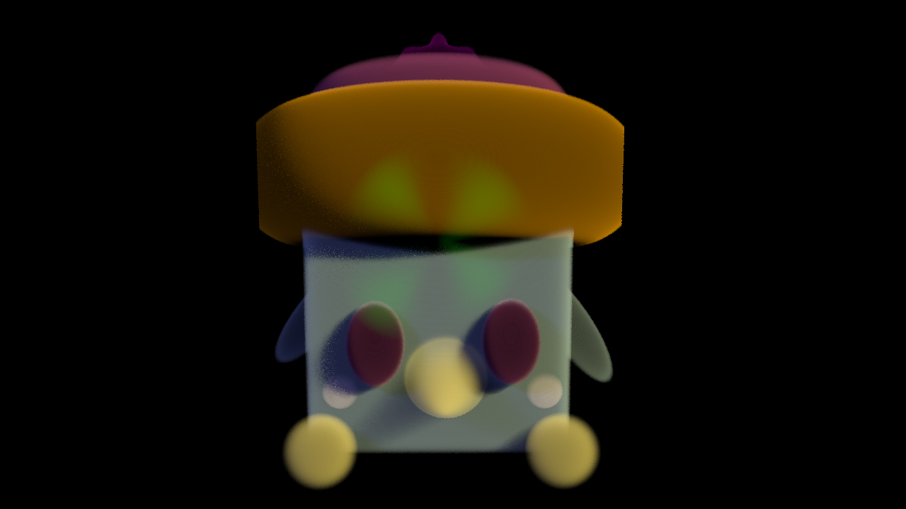

# SG_VolumeRenderer (WIP)
A VolumeRenderer to modify and play with volumetric data.

  Above - Model generated using all available implicit shapes and 2 lights of different Colors.

 An efficient CPU Ray Marching Renderer of Discrete & Gridded Volumes. 
Currently:
- Supports 10 implicit shapes (Sphere, Elipse, Torus, Cube, Plane, Cone, Cylinder, Icosahedron, Steiner Patch)
- Supports Multiple Lights and Deep Shadow Maps.
- Optimized with AABB(Auto Aligned Bounding Boxes).

 <b>Requires</b>: OpenImageIO and Boost 1.66(minumum)
